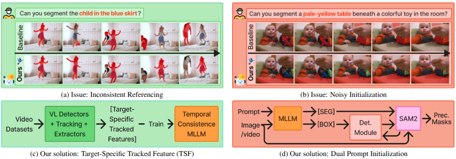

# SPARROW: Learning Spatial Precision and Temporal Referential Consistency in Pixel-Grounded Video MLLMs

<!-- <p align="center">
    <a href="https://arxiv.org/abs/2404.13013"></a>
    <a href="https://huggingface.co/RISys-Lab"></a>
</p> -->

<p align="center">
  📄 <a href="#">Paper</a>&nbsp;&nbsp;|&nbsp;&nbsp;
  🌐 <a href="https://risys-lab.github.io/SPARROW">Project Page</a>&nbsp;&nbsp;|&nbsp;&nbsp;
  🤖 <a href="https://huggingface.co/RISys-Lab/sparrow-finetune">Model</a>&nbsp;&nbsp;|&nbsp;&nbsp;
  📘 <a href="https://huggingface.co/datasets/RISys-Lab/sparrow-dataset">Dataset</a>
</p>

**Official repository for "SPARROW : Learning Spatial Precision and Temporal Referential Consistency in Pixel-Grounded Video MLLMs" (CVPR 2026).**

**Authors:** Mohamad Alansari<sup>\*</sup>, Naufal Suryanto<sup>\*</sup>, Divya Velayudhan, Sajid Javed, Naoufel Werghi, and Muzammal Naseer

Khalifa University, <sup>*</sup>Equal contribution

---

## 📑 Table of Contents
- [News](#-news)
- [Introduction](#-introduction)
- [Model Lineup](#-model-lineup)
- [Getting Started](#-getting-started)
- [Training](#-training)
- [Evaluation](#-evaluation)
- [Citation](#-citation)

## 📰 News
- 2026-03-13: SPARROW project page is now available!
- 2026-02-21: Our paper has been accepted to CVPR 2026!

### Release Plan & Checklist

We are releasing SPARROW code, models, and datasets. Track our progress here:

<details>
  <summary><b>View checklist</b></summary>

#### 1) Code & Inference
- [ ] Release SPARROW code.
- [ ] Add inference examples.

#### 2) Models
- [ ] Release pretrained SPARROW.
- [ ] Release per-dataset finetuned SPARROW.

#### 3) Data & Training
- [ ] Add dataset preparation guide.
- [ ] Add training instructions.

</details>

---

## 🤖 Introduction

**SPARROW** introduces a novel approach to learning spatial precision and temporal referential consistency in pixel-grounded video Multi-modal Large Language Models (MLLMs). 

<p align="center">
  
</p>

**Comparison of temporal consistency and initialization quality in video object segmentation:**

* (a) The baseline method suffers from temporal drift, leading to inconsistent segmentation of the same object across frames.  
* (b) Noisy or unstable initialization propagates segmentation errors through subsequent frames.  
* (c) Our proposed **Target-Specific Tracked Feature** mitigates drift by maintaining consistent object grounding over time.  
* (d) The **Dual-Prompt Initialization** strategy improves segmentation precision and stability during early frames.

---

## 🧠 Model Lineup

To play with SPARROW, please download the model weights from Hugging Face. We additionally provide pretrained checkpoints from intermediate training stages so you can start from any point to customize training.

| Training stage | Required checkpoints | Link |
| :--- | :--- | :--- |
| **Detection pretraining** | SAM2-L | [🤗 Link](https://huggingface.co/RISys-Lab/sparrow-det-pretrain) |
| **Finetuned Models** | SPARROW | [🤗 Link](https://huggingface.co/RISys-Lab/sparrow-finetune) |

*(More checkpoints to be added soon)*

---

## 🚀 Getting Started

### 🔧 Environment Setup

Clone the repository:
```bash
git clone https://github.com/RISys-Lab/SPARROW.git
cd SPARROW
```

We provide two dependency files: `environment.yml` (recommended) and `requirements.txt` (fallback).

#### Option A: Conda (Recommended)

```bash
conda env create -f environment.yml
conda activate sparrow
```

#### Option B: Pip (Manual)

```bash
conda create -n sparrow python=3.11.11 -y
conda activate sparrow
pip install torch==2.6.0 torchvision==0.21.0 torchaudio==2.6.0 --index-url https://download.pytorch.org/whl/cu124
pip install --upgrade pip
```

### 📦 Additional Dependencies

**1. MMCV**
You need to [build MMCV from source](https://mmcv.readthedocs.io/en/latest/get_started/build.html).

> **Note:** Ensure you change the MMCV version to `2.1.0`.

**2. Flash Attention (for training)**

```bash
pip install ninja
pip install flash-attn --no-build-isolation
```

### 📥 Checkpoints

Download the required checkpoints before running the project. Store the checkpoints in the following locations:
- Put most project checkpoints under `checkpoints/`
- Put the Hugging Face checkpoints below under `checkpoints_hf/`
- Store **InternVideo2** in the base repository under `OpenGVLab/InternVideo2-Stage2_1B-224p-f4/`

Expected directory structure:
```bash
SPARROW/
├── checkpoints/
│   ├── sam2_hiera_large.pt
│   ├── VideoGLaMM/
│   └── sparrow-finetune/
├── checkpoints_hf/
│   ├── ddetr_sam2/
│   └── MBZUAI/
│       └── VideoGPT-plus_Phi3-mini-4k/
│           ├── mvbench/
│           └── vcgbench/
├── OpenGVLab/
│   └── InternVideo2-Stage2_1B-224p-f4/
└── ...
```
Download the checkpoints from the following sources:

* SAM2 checkpoints: [Download Here](https://dl.fbaipublicfiles.com/segment_anything_2/072824/sam2_hiera_large.pt). Place the file at:
`checkpoints/sam2_hiera_large.pt`

* InternVideo2 checkpoint: [Download Here](https://huggingface.co/OpenGVLab/InternVideo2-Stage2_1B-224p-f4). Place the folder at: `OpenGVLab/InternVideo2-Stage2_1B-224p-f4/`

* VideoGLaMM checkpoint: [Download Here](https://mbzuaiac-my.sharepoint.com/:f:/g/personal/shehan_munasinghe_mbzuai_ac_ae/Etucj3LuqdRDocrle_8eJbcB8C11u-020AX7fwIYWJh-dg?e=uPanYM). Place the contents under: `checkpoints/VideoGPTPlus-Phi3-SAM2-8frame-tunevlproj-epoch29/`

* SPARROW checkpoint: [Download Here](https://huggingface.co/RISys-Lab/sparrow-finetune). Place the folder at: `checkpoints/sparrow-finetune/`

* SPARROW detection pretrain checkpoint: [Download Here](https://huggingface.co/RISys-Lab/sparrow-det-pretrain). Choose any checkpoint from this repository, rename it to ddetr_sam2, and place it under: `checkpoints_hf/ddetr_sam2/`

* VideoGPT-plus Phi3-mini-4k checkpoint: [Download Here](https://huggingface.co/MBZUAI/VideoGPT-plus_Phi3-mini-4k). Place the folder at: `checkpoints_hf/MBZUAI/VideoGPT-plus_Phi3-mini-4k/`

---

## 🛠️ Training

### Stage 1: Detection Pretraining

For detailed instructions on setting up and running the initial detection pretraining phase, please refer to **[`README_STAGE1.md`](./README_STAGE1.md)**.

*(Further training instructions and stages will be released soon)*

---

## 🧪 Evaluation

SPARROW achieves state-of-the-art and consistently improves performance across the referring video object segmentation, video visual grounding, and grounded conversation generation benchmarks.

<table> <thead> <tr> <th rowspan="2">Method</th> <th colspan="2">MeViS</th> <th colspan="2">RVOS</th> <th rowspan="2">VidSTG<br>mIoU</th> <th rowspan="2">VideoGCG<br>mIoU</th> </tr> <tr> <th>val<br>J&amp;F</th> <th>val<sup>u</sup><br>J&amp;F</th> <th>Ref-YTVOS<br>J&amp;F</th> <th>Ref-DAVIS17<br>J&amp;F</th> </tr> </thead> <tbody> <tr align="center"> <td>UniPixel</td> <td>53.1</td> <td>59.7</td> <td>70.5</td> <td>74.2</td> <td>41.25</td> <td>52.0</td> </tr> <tr align="center" style="background-color: #EAF3FF;"> <td>UniPixel + SPARROW</td> <td><b>54.4</b></td> <td><b>60.7</b></td> <td><b>70.7</b></td> <td><b>76.4</b></td> <td><b>46.74</b></td> <td><b>54.5</b></td> </tr> <tr align="center"> <td>GLUS</td> <td>51.3</td> <td>59.8</td> <td>67.3</td> <td>72.9</td> <td>29.92</td> <td>45.86</td> </tr> <tr align="center" style="background-color: #EAF3FF;"> <td>GLUS + SPARROW</td> <td><b>53.2</b></td> <td><b>61.9</b></td> <td><b>69.1</b></td> <td><b>75.5</b></td> <td><b>35.17</b></td> <td><b>47.91</b></td> </tr> <tr align="center"> <td>VideoGLaMM</td> <td>45.2</td> <td>48.5</td> <td>66.8</td> <td>69.5</td> <td>39.66</td> <td>62.34</td> </tr> <tr style="background-color: #ADD8E6;" align="center"> <th>VideoGLaMM + SPARROW</th> <th>47.5</th> <th>57.4</th> <th>68.9</th> <th>76.8</th> <th>45.06</th> <th>65.59</th> </tr> </tbody> </table>

---

## 🧾 Citation

If you find SPARROW useful in your research, please consider citing our paper:

```bibtex
@inproceedings{alansari2026sparrow,
  title={SPARROW: Learning Spatial Precision and Temporal Referential Consistency in Pixel-Grounded Video MLLMs},
  author={Alansari, Mohamad and Suryanto, Naufal and Velayudhan, Divya and Javed, Sajid and Werghi, Naoufel and Naseer, Muzammal},
  booktitle={Proceedings of the IEEE/CVF Conference on Computer Vision and Pattern Recognition (CVPR)},
  year={2026}
}
```
